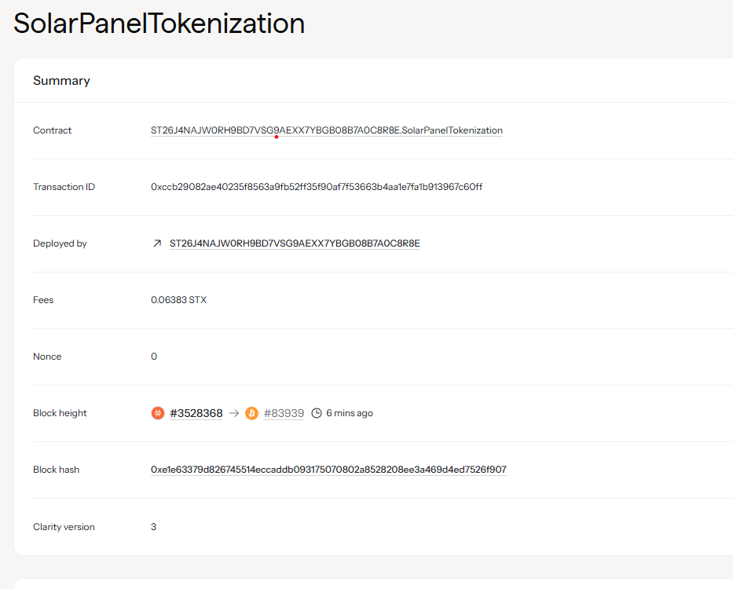

# SolarPanel Tokenization

## Project Description

The SolarPanel Tokenization project enables fractional ownership of solar panel installations through blockchain technology. Users can purchase shares in solar installations and receive proportional revenue from energy production. This innovative approach democratizes access to renewable energy investments and creates a sustainable revenue-sharing ecosystem.

The smart contract implements a tokenized system where investors can buy fractional ownership stakes in solar panel installations and automatically receive their share of energy production revenue based on their token holdings.

## Project Vision

Our vision is to revolutionize renewable energy financing by making solar investments accessible to everyone. We aim to:

- **Democratize Solar Investment**: Enable small-scale investors to participate in large solar projects
- **Create Sustainable Revenue Streams**: Provide ongoing passive income through energy production
- **Promote Renewable Energy Adoption**: Lower barriers to solar installation funding
- **Build Transparent Energy Markets**: Use blockchain technology for transparent, automated revenue distribution
- **Foster Community-Owned Energy**: Enable local communities to own and benefit from their energy infrastructure

## Future Scope

The SolarPanel Tokenization project has extensive potential for growth and enhancement:

### Technical Enhancements
- **Multi-Panel Portfolios**: Allow users to diversify across multiple solar installations
- **Dynamic Pricing Models**: Implement real-time valuation based on energy production performance
- **Weather Integration**: Connect with weather APIs to predict and adjust revenue distributions
- **Energy Trading**: Enable token holders to trade energy credits in secondary markets

### Expansion Opportunities
- **Global Deployment**: Extend to international solar markets with local currency support
- **Other Renewable Sources**: Expand to wind farms, hydroelectric, and other clean energy projects
- **Carbon Credit Integration**: Incorporate carbon offset trading for additional revenue streams
- **Insurance Products**: Develop parametric insurance for weather-related production losses

### Governance Features
- **Decentralized Voting**: Allow token holders to vote on maintenance decisions and upgrades
- **Performance Analytics**: Advanced dashboards showing real-time energy production and ROI
- **Maintenance Funding**: Automatic reserve funds for panel maintenance and replacements

### Financial Products
- **Staking Mechanisms**: Lock tokens for higher yield and priority access to new installations
- **Lending Protocols**: Use solar tokens as collateral for DeFi lending
- **Yield Farming**: Liquidity mining opportunities with solar token pairs

## Contract Address Details
contract ID:ST26J4NAJW0RH9BD7VSG9AEXX7YBGB08B7A0C8R8E.SolarPanelTokenization

**Contract addresses will be added after deployment:**

- **Mainnet Contract**: [To be added]
- **Testnet Contract**: [To be added]
- **Token Symbol**: SOLAR
- **Token Decimals**: 6
- **Contract Version**: 1.0.0

---

## Getting Started

### Prerequisites
- Stacks wallet (Hiro Wallet, Xverse, etc.)
- STX tokens for transactions
- Basic understanding of blockchain and smart contracts

### How to Use

1. **Purchase Panel Shares**: Call `purchase-panel-shares` with panel ID, desired share amount, and STX payment
2. **Claim Revenue**: Use `distribute-energy-revenue` to claim your share of energy production revenue
3. **Check Ownership**: View your ownership stakes and revenue claims through read-only functions

### Contract Functions

#### Main Functions
- `purchase-panel-shares(panel-id, share-amount, stx-payment)` - Buy fractional ownership in a solar panel
- `distribute-energy-revenue(panel-id, total-revenue)` - Distribute energy revenue to token holders

#### Read-Only Functions  
- `get-panel-info(panel-id)` - Get solar panel details
- `get-ownership(panel-id, owner)` - Check ownership amount
- `get-token-balance(owner)` - Get solar token balance

---

*This project represents a significant step toward sustainable, community-owned renewable energy infrastructure powered by blockchain technology.*